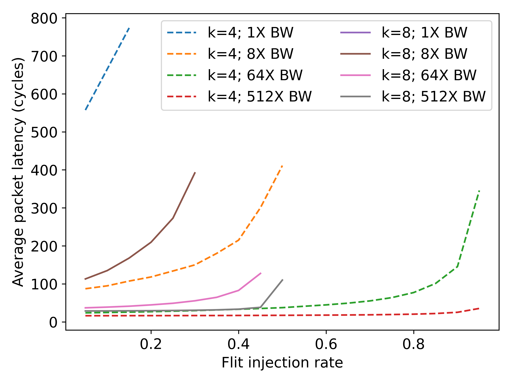
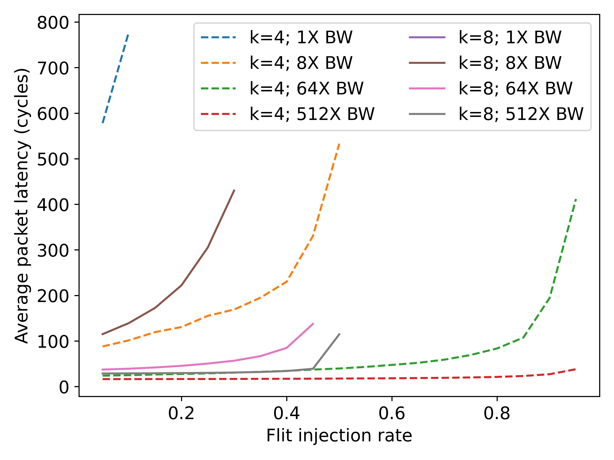
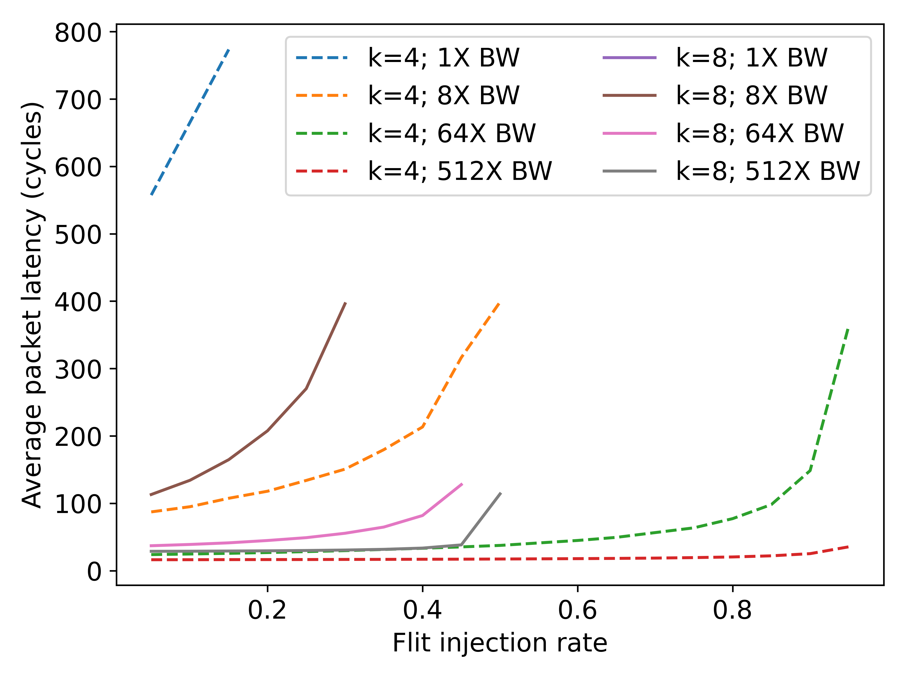

# Monolithic 3-Dimensional Network-on-Chip (M3DNoC)

## Description

This repo contains driver code for performing the experiments shown in our EE382C project report.

## Appendices

Here are three plots comparing dimension-order, XY-YX, and minimal-adaptive routing for k = 4 and k = 8 3D meshes under uniform traffic.

### dimension-order

### XY-YX

### minimal-adaptive

